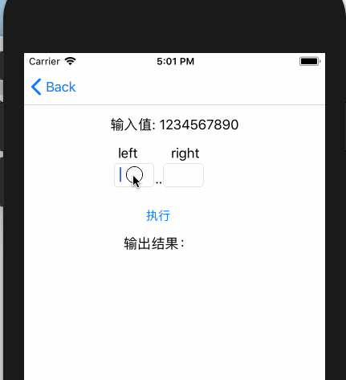

# betterSwift
Use swift easily

## String
- string split (fast split string use slice just like python)

How to code:
```
let str = "1234567890"
str[1..]  				// 234567890
str[..5]   				// 123456
str[1..4]  				// 2345
str[2..-2]				// 3456789
str[-4..-2]				// 789
```
Error:
```
str[5..4] str[-2..-4] str[4..-7] 	// nil (start larger than end)
st[11..]  str[..12]   str[..-12] 	// nil (out of range)
str[-1..2]               // nil (meaningless)
```


How to use:

```
pod 'BetterSwift/String'
```

